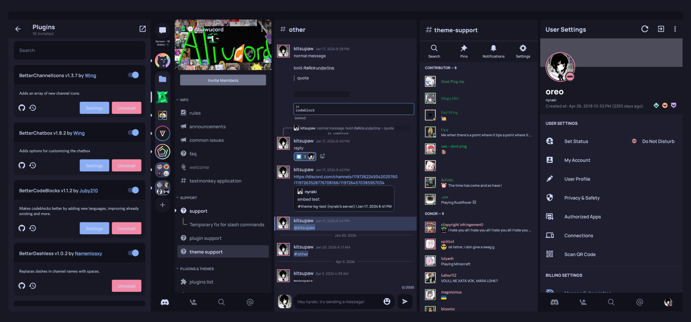

<h3 align="center">
	 
	
	Catppuccin for <a href="https://github.com/kmmiio99o/ShiggyCord">ShiggyCord</a>
	
</h3>

## Usage

Either copy the raw file link or copy the contents of the json to your clipboard to install the theme in Shiggycord. Enjoy!

## 💝 Thanks to:

- [Skinatro](https://github.com/skinatro)
- [lemon](https://github.com/andreasgrafen)
- [Isabelinc](https://github.com/Isabelincorp)
- [WitherCubes](https://github.com/WitherCubes) 
- [myumichi](https://github.com/myumichi)  
and everyone else who made the original Discord PC and Aliucord port!
&nbsp;

Copyright &copy; 2021-present <a href="https://github.com/catppuccin" target="_blank">Catppuccin Org</a>

